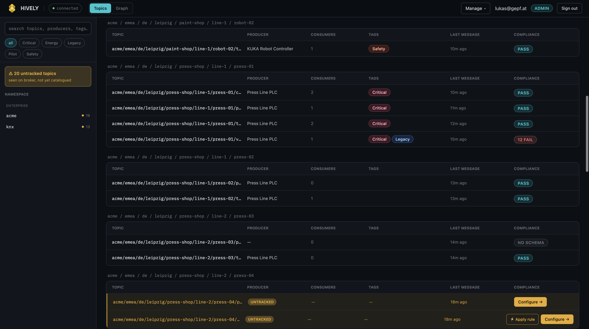
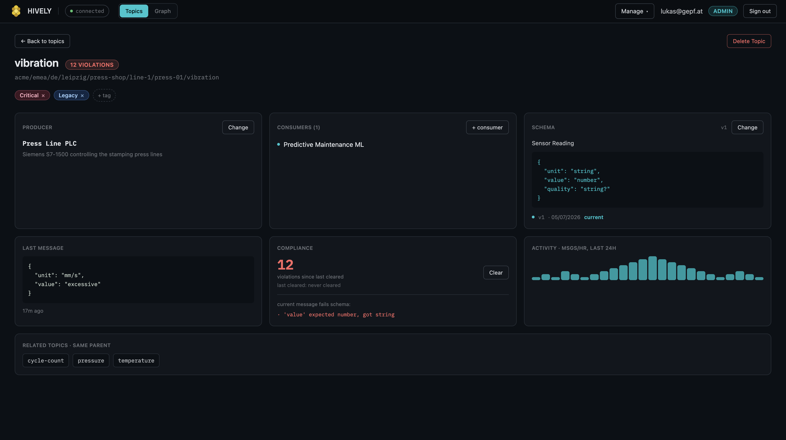
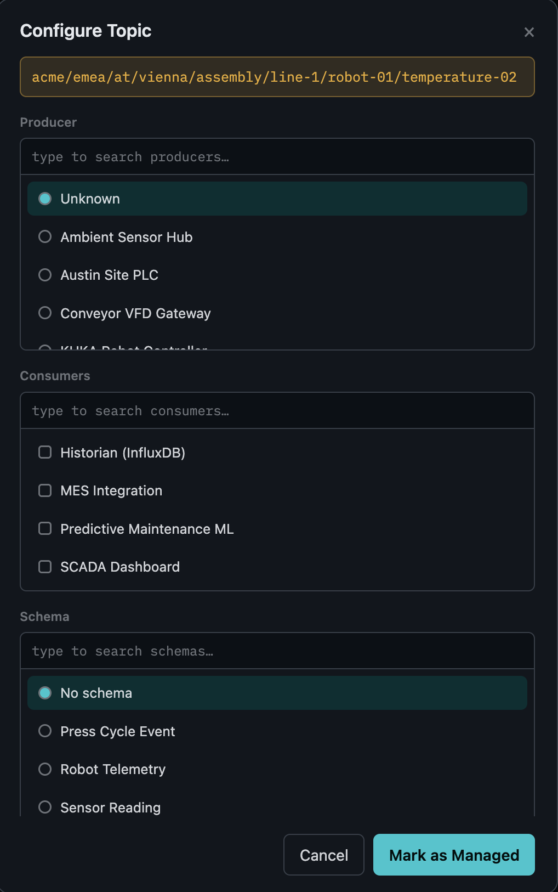
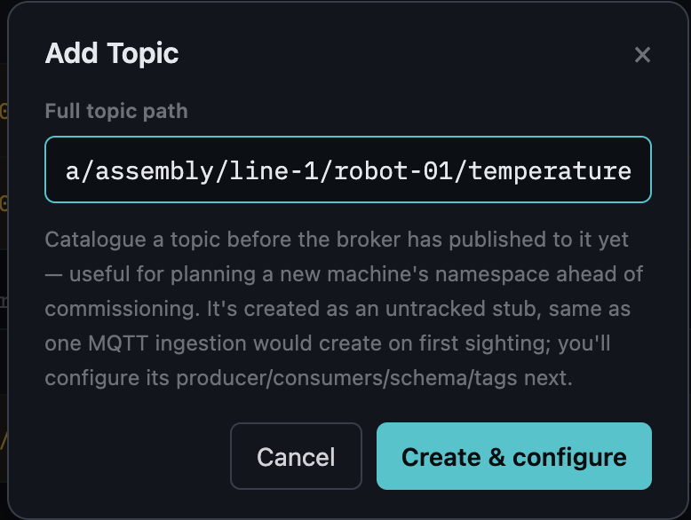
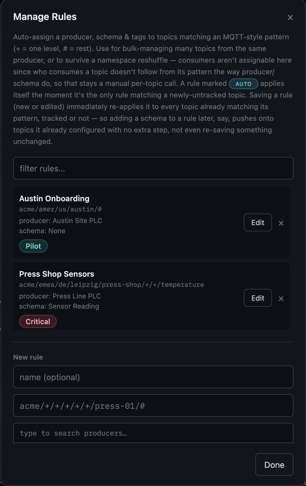
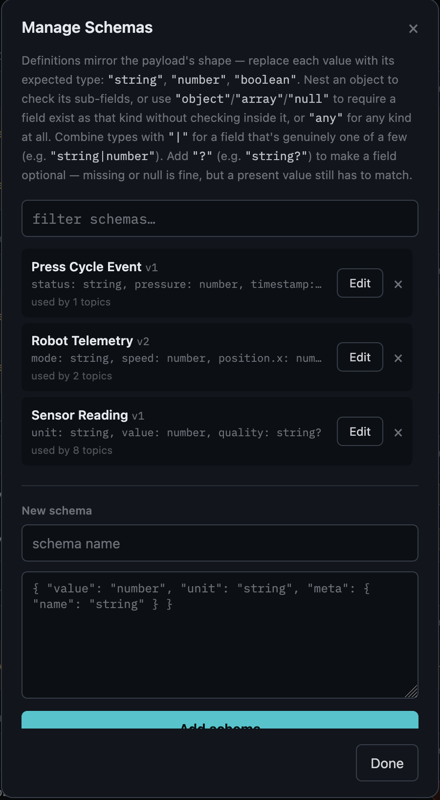
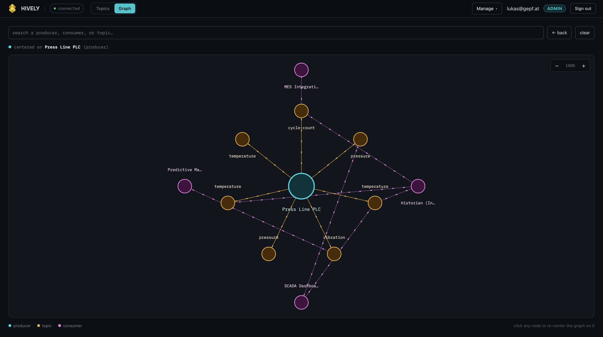

<p align="center">
  
</p>

# Hively

A data catalog for an MQTT Unified Namespace.

Kafka has had this solved for years — Confluent's Data Catalog will tell you, for any topic, who's publishing to it, who's consuming it, what shape the messages are supposed to be, and whether they actually match. MQTT never got an equivalent, even though Unified Namespace architectures (the pattern where a factory's entire operational data flows through one broker, topic paths mirroring the physical plant) have become common enough in industrial settings that the same problem shows up constantly: nobody can say with confidence what's actually flowing through the namespace, whether a given topic is even being looked at by anyone, or whether the payload on it still looks like it did six months ago. Usually that knowledge lives in someone's head, or a spreadsheet that's already out of date. Hively is what that catalog should look like.

The specific failure mode that makes this worse than it sounds: a Unified Namespace topic path typically encodes *where* something physically sits (`enterprise/site/area/line/cell/equipment/...`). That's a genuinely nice property, until a piece of equipment gets physically relocated — a press moves from one line to another, or one plant to another entirely — and every single topic under it changes path at once. Nothing about the machine or its sensors changed, but from the namespace's point of view it just went completely dark, and a wholly new set of topics appeared out of nowhere. Without tooling, that looks identical to "we lost the data feed" and identical to "someone plugged in fifty new sensors," and figuring out which one actually happened means someone manually diffing topic trees.

## What it does

Hively watches the broker and keeps a live catalog of every topic that's ever shown up on it, so nothing new appears without someone noticing. A topic Hively has never seen before is flagged **untracked** immediately, with a running count of how many are waiting for attention — that's the "something changed, go look" signal. The namespace sidebar lets you drill down the path hierarchy the same way you'd navigate a filesystem, rather than facing one flat list of everything.

<p align="center"></p>
<p align="center"><i>Namespace drill-down on the left; untracked-topic count above it. Each row shows resolved producer, consumer count, tags, and compliance at a glance.</i></p>

Clicking into any topic opens its full record: producer, consumers, assigned schema, last message, compliance status, a 24-hour activity histogram, and any sibling topics under the same parent path — everything you'd need to answer "what is this, and is it healthy" without leaving the page.

<p align="center"></p>
<p align="center"><i>A non-compliant topic: the violation count, the exact field that fails the schema ('value' expected number, got string), and the activity trend all in one place.</i></p>

Bringing an untracked topic under management means saying who produces it, who (if anyone) consumes it, what schema its payload should satisfy, and which tags it belongs to — all from one modal.

<p align="center"></p>
<p align="center"><i>Assigning producer, consumers, and schema from a searchable picker — each supports creating a new entry inline if it doesn't exist yet.</i></p>

You don't have to wait for the broker to publish before cataloguing something, either — a topic can be created ahead of time while a new machine is still being commissioned, and it behaves exactly like one MQTT ingestion would create on first sighting.

<p align="center"></p>
<p align="center"><i>Planning a topic path before the equipment publishing to it even exists yet.</i></p>

Configuring topics one at a time doesn't hold up once a namespace has any real size to it, so **rules** exist to do it in bulk: a saved MQTT pattern (`press-01/+/#`-style, wildcards and all) carries a producer, a schema, and a tag set, and applies to everything that matches. A rule can also be trusted to apply itself automatically the instant it's the *only* rule matching a newly-seen topic — multiple candidate rules always fall back to a human picking, deliberately, since guessing wrong here is worse than asking. Saving a rule immediately re-applies it to everything it already matches too, so an edit (adding a schema after the fact, say) never gets stuck only affecting topics tracked from that point forward.

<p align="center"></p>
<p align="center"><i>A rule bulk-assigning producer, schema, and tags to every topic matching its pattern — consumers are deliberately excluded, since who consumes a topic doesn't follow from its path the way producer/schema do.</i></p>

Then there's the relocation problem from above. When a topic goes untracked, Hively checks whether it looks like the tail end of some existing tracked topic that's gone quiet recently — same last few path segments, different prefix, no traffic in a while. If so, it surfaces that as a suggestion: *this is probably the same measurement point, just moved* — with a one-click way to inherit the old topic's producer, schema, tags, and violation history rather than starting that topic's story over from zero. It's a heuristic, never an automatic merge; an admin always confirms it explicitly.

Once a topic has a schema assigned, Hively checks every incoming message against it and keeps count of violations, so compliance drift shows up as a number going up rather than something someone notices three months later while debugging an unrelated issue. Schemas are written as JSON that mirrors the shape of the payload itself — nested objects included — with individual fields markable as optional, or typed as a union when a value genuinely varies (some KNX datapoints, for instance, report as a string in one message and a number in the next).

<p align="center"></p>
<p align="center"><i>Three schemas of increasing shape: a flat sensor reading, one with an optional field, and a nested one (Robot Telemetry) — the definition mirrors the payload's own structure.</i></p>

Everything above updates live in the UI the moment it happens on the broker — a new untracked topic, a compliance change, the broker itself dropping connection — instead of the page quietly going stale until someone refreshes it. And a relationship graph lets you pick any producer, topic, or consumer and see everything connected to it, with the actual direction of data flow animated on each edge, for the times a table just isn't the right shape to think in.

<p align="center"></p>
<p align="center"><i>Centered on a producer: its topics fan out in the middle ring, their consumers on the outer ring, with animated edges showing the true producer → topic → consumer flow direction.</i></p>

## Running it locally

You'll need .NET 10, Node 20+, and either Docker or Podman.

```bash
# Postgres + a local Mosquitto broker
docker compose up -d

# Backend (also launches the Vite dev server via SpaProxy)
dotnet run --project Hively.Server
```

The backend listens on `https://localhost:8443` by default (see `Hively.Server/Properties/launchSettings.json` if you need to change it — make sure you run the **"https" profile**, not "http"; the http-only one has no HTTPS endpoint at all, which breaks Google/Entra login since the OIDC redirect URI ends up computed as `http://` instead of `https://`). Logging in needs at least one provider enabled — real Google or Entra ID OAuth credentials in .NET user-secrets, or a single username/password pair for the built-in basic-auth provider — see `docs/deployment.md` for the exact config keys.

A built image will also be published at `ghcr.io/gepf-solutions/hively` if you'd rather run it directly against your own Postgres and broker than build from source — configuration is all environment variables there; see `docs/deployment.md` for the full list and a ready-to-adapt `docker run` example.

## Stack, briefly

ASP.NET Core + React/TypeScript, Postgres, a real MQTT client against a real broker (not mocked), SignalR for the live updates.

## Where things stand

The full catalog is built and working end to end against a real broker: topic tracking, rules, relocation recovery, schema compliance, the graph, real login (Google, Entra ID, or basic auth) with Admin/Viewer roles. What it hasn't been through yet is any real production traffic or an automated test suite — everything so far has been verified by hand. Worth knowing before pointing it at anything that matters.

## License

Not yet decided — treat this as source-available for now, not open source, until that's settled.
